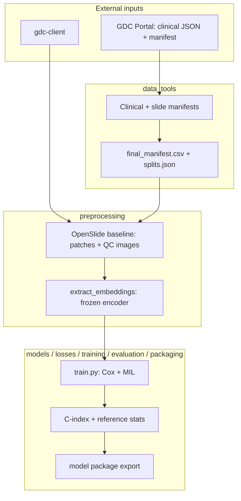
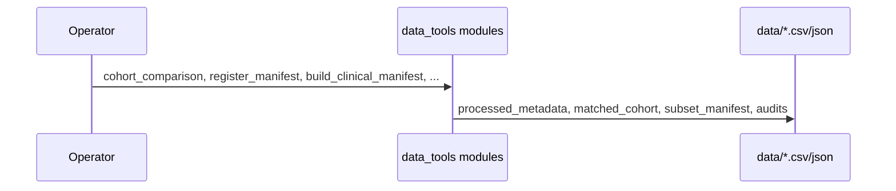
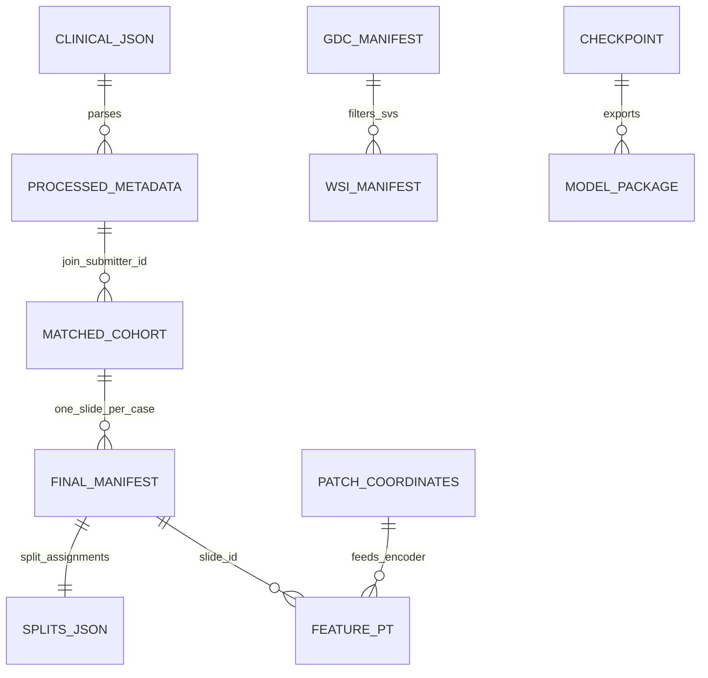

# PathoSurv ML

## Overview

**PathoSurv ML** is an offline research and training codebase for **PathoSurv Lite**: it prepares TCGA whole-slide image (WSI) survival data, preprocesses slides, extracts patch embeddings, trains Cox survival models (mean-pooling baseline and attention-based multiple-instance learning), evaluates ranking metrics, and exports a versioned **model package** for downstream inference in a separate web product.

This repository is **not** the PathoSurv Lite web application. There is **no HTTP API**, **no database server**, **no Docker Compose stack**, and **no authentication** in this repo—those appear only in planning documents under `plan/`. Everything here runs as **Python CLI modules** and **orchestration scripts**, reading and writing files under `data/` and `configs/`.

**Domain (current default cohort):** TCGA-BLCA, overall survival (OS) as `survival_time_days` + `event_status`, one diagnostic WSI per patient in `final_manifest.csv`, patient-level train/validation/test splits.

**Research scope:** MergeSurv-inspired survival risk from WSI (patch embeddings → slide aggregator → Cox head). Training is intended to run locally or on **Google Colab** with GPU; large binaries stay out of Git (see `.gitignore`).

Further detail (Vietnamese): [docs/HUONG_DAN_HUAN_LUYEN.md](docs/HUONG_DAN_HUAN_LUYEN.md), [docs/WORKFLOW.md](docs/WORKFLOW.md), [docs/GDC_DATA_GUIDE.md](docs/GDC_DATA_GUIDE.md). Clone/Colab checklist: [docs/REPO_READINESS.md](docs/REPO_READINESS.md).

---

## Tech Stack

| Technology | Role in this repo |
|------------|-------------------|
| **Python 3.10–3.13** | Runtime (`requires-python <3.14` for `scikit-survival` wheels) |
| **PyTorch + torchvision** | Frozen patch encoder (ResNet50 ImageNet fallback), MIL/Cox heads, checkpoints |
| **pandas / NumPy** | Manifests, clinical tables, audits |
| **PyYAML** | All paths and hyperparameters under `configs/` |
| **scikit-survival** | Harrell’s C-index in `evaluation/concordance.py` |
| **pytest** | Verification gate (no CI config in repo) |
| **OpenSlide + OpenCV + Pillow** | Optional `[wsi]` extra: read `.svs`, tissue mask, patch coordinates |
| **GDC Data Transfer Tool** | External `gdc-client` to download WSI (not bundled) |
| **Jupyter** | Optional `[dev]` — e.g. `notebooks/00_colab_smoke_test.ipynb` |

---

## Architecture

The system is a **file-driven batch pipeline**, not a request/response service. Components communicate through **CSV/JSON artifacts** and **PyTorch `.pt` files** whose paths are declared in `configs/data.yaml` and resolved by `pathosurv.config.data_config()`.



**Core library layer:** `pathosurv/` — `project_root()`, `resolve_path()`, `load_yaml()`, `data_config()`, `set_seed()`.

**There is no Controller → Service → Repository → Database stack.** The closest analogue:

| Layer | Implementation |
|-------|----------------|
| Orchestration | `scripts/*.py` (subprocess chains) |
| Domain logic | `data_tools/`, `preprocessing/`, `training/`, `models/`, `evaluation/`, `packaging/` |
| Persistence | Files under `data/` (gitignored: `raw_slides/`, `features/`, `preprocessed/`) |
| Configuration | `configs/*.yaml` |

---

## Project Structure

```text
pathosurv-ml/
├── pathosurv/           # Config, paths, reproducibility seed
├── data_tools/          # GDC cohort ETL, manifests, downloads, validation
├── preprocessing/       # WSI open/validate, patch grid, embedding extraction
├── models/              # Encoder wrapper, MeanPoolingCox, AttentionMILCox, CoxHead
├── losses/              # Cox partial likelihood
├── training/            # Dataset bags, train loop, checkpoints, synthetic demo data
├── evaluation/          # C-index, checkpoint eval, reference risk statistics
├── packaging/           # Export pathosurv-model-v1/ layout for inference app
├── configs/             # data, project, preprocessing, encoder, model, training
├── scripts/             # End-to-end orchestration (ordered pipelines)
├── tests/               # pytest (manifest, Cox, shapes, preprocessing, env)
├── data/                # Committed manifests/audits; large binaries gitignored
├── docs/                # Workflow, GDC guide, training guide (Vietnamese)
├── notebooks/           # Colab smoke notebook
└── plan/                # Product SRS / requirements (not implemented in this repo)
```

### Module roles

| Package | Responsibility |
|---------|------------------|
| `data_tools` | Parse GDC clinical JSON and tab manifest; merge survival; pick one slide per patient (`slide_selection.py`); patient splits; `gdc-client` subset download and MD5 verify |
| `preprocessing` | `validate_wsi.py`, OpenSlide+OpenCV pipeline in `wsi_preprocess.py`, entry `run_trident.py` (currently `openslide_baseline` backend), `extract_embeddings.py`, `validate_embeddings.py`, `validate_patches.py` |
| `models` | `encoder.py` loads frozen **ResNet50** fallback; TITAN raises `NotImplementedError` until wired |
| `training` | `SurvivalBagDataset` loads per-slide `.pt` bags; `train.py` optimizes Cox loss; `--synthetic-demo` builds fake cohort for pipeline smoke |
| `evaluation` | `harrell_c_index`; `evaluate.py`; `reference_statistics.py` for percentile thresholds |
| `packaging` | `build_model_package.py` → `data/model_packages/pathosurv-model-v1/` |

---

## Application Flow

There is **no client HTTP request flow**. Typical **end-to-end processing** looks like this:

### 1. Cohort and survival tables (GDC → CSV)



Ordered shortcut (same steps as the GDC cohort orchestrator in `scripts/`):

```bash
python -m data_tools.cohort_comparison
python -m data_tools.register_manifest
python -m data_tools.build_clinical_manifest
python -m data_tools.build_slide_manifest
python -m data_tools.merge_survival_manifest
python -m data_tools.validate_manifest
python -m data_tools.download_subset --no-download
python -m data_tools.verify_downloads
```

Manual prerequisites: `data/clinical.json`, versioned `data/gdc_manifest.*.txt`, `configs/data.yaml` → `manifest_path`. See [docs/GDC_DATA_GUIDE.md](docs/GDC_DATA_GUIDE.md).

Optional WSI download (smoke: align slides with `final_manifest.csv` — do **not** use bare `-n 3` only):

```bash
python -m data_tools.download_subset --from-final-manifest -n 3
python -m data_tools.verify_downloads
python -m preprocessing.validate_wsi
```

Full cohort manifest (no download): `--from-final-manifest -n 359 --no-download --output-manifest data/cohort_wsi_manifest.txt`

### 2. Training manifest and splits

```bash
python -m data_tools.build_final_manifest
python -m data_tools.validate_final_manifest
python -m data_tools.create_patient_splits
python -m data_tools.validate_final_manifest --require-split
```

Validation:

```bash
python -m data_tools.validate_final_manifest
python -m data_tools.validate_final_manifest --require-split
python -m data_tools.validate_final_manifest --require-wsi   # when all WSIs exist on disk
```

### 3. WSI → patches → embeddings

Requires `pip install -e ".[wsi]"` and files in `data/raw_slides/`:

```bash
python -m preprocessing.run_trident
python -m preprocessing.validate_patches
python -m preprocessing.extract_embeddings --max-patches 200
python -m preprocessing.validate_embeddings
```

Outputs: `data/preprocessed/<slide_id>/` (thumbnail, tissue mask, `patch_coordinates.csv`), `data/features/<slide_id>.pt`.

### 4. Train → evaluate → package

Full cohort (needs embeddings for train/val cases):

```bash
python -m training.train --model mean_pooling_cox
python -m training.train --model attention_mil_cox
python -m evaluation.evaluate --checkpoint data/checkpoints/attention_mil_cox_best.pt --split test
python -m evaluation.reference_statistics --checkpoint data/checkpoints/attention_mil_cox_best.pt
python -m packaging.build_model_package --checkpoint data/checkpoints/attention_mil_cox_best.pt
```

**Pipeline smoke** (focused pytest + subset embeddings + synthetic Cox train + package):

```bash
pytest tests/test_cox_loss.py tests/test_model_shapes.py tests/test_cindex.py -q
python -m preprocessing.extract_embeddings --max-patches 50
python -m preprocessing.validate_embeddings
python -m training.train --model mean_pooling_cox --synthetic-demo
python -m training.train --model attention_mil_cox --synthetic-demo
python -m evaluation.evaluate --checkpoint data/checkpoints/attention_mil_cox_best.pt --manifest data/features/synthetic_manifest.csv --split test --output data/metrics_test.json
python -m evaluation.reference_statistics --checkpoint data/checkpoints/attention_mil_cox_best.pt --manifest data/features/synthetic_manifest.csv
python -m packaging.build_model_package --checkpoint data/checkpoints/attention_mil_cox_best.pt --manifest data/features/synthetic_manifest.csv
```

The same sequence is bundled as `python scripts/run_training_smoke.py`. Full cohort steps: [docs/HUONG_DAN_HUAN_LUYEN.md](docs/HUONG_DAN_HUAN_LUYEN.md).

---

## Core Components

| Component | Location | Notes |
|-----------|----------|--------|
| Path resolution | `pathosurv/paths.py` | Override root with `PATHOSURV_ROOT` |
| Config loader | `pathosurv/config.py` | `data_config()` resolves all `*_path` / `*_dir` keys |
| GDC manifest helpers | `data_tools/gdc_manifest.py` | Tab-separated manifest, TCGA barcode parsing |
| WSI path resolution | `data_tools/wsi_paths.py` | Flat or `uuid/filename.svs` layout from `gdc-client` |
| Cox loss | `losses/cox_ph_loss.py` | Higher risk score ⇒ shorter survival |
| Early stopping | `training/early_stopping.py` | On validation C-index |
| Model package contract | `packaging/build_model_package.py` | Aligns with PathoSurv Lite SRS in `plan/` (inference app consumes package separately) |

**Not present:** cache, message queue, scheduler, OAuth/Keycloak, PostgreSQL, MinIO, FastAPI workers.

---

## Data Model

Data is **relational in meaning** but stored as **files**, not ORM entities.



### Key artifacts

| Artifact | Columns / content |
|----------|-------------------|
| `processed_metadata.csv` | `case_id`, `submitter_id`, `OS_time`, `OS_event`, … |
| `matched_cohort.csv` | GDC file rows + survival (multiple slides per patient possible) |
| `final_manifest.csv` | `case_id`, `slide_id`, `wsi_path`, `survival_time_days`, `event_status`, `split` — **one row per patient** |
| `dataset_audit.json` | Excluded duplicate slides (`duplicate_patient_not_selected`) |
| `splits.json` | Per-split case counts, event counts, `case_ids` lists |
| `patch_coordinates.csv` | `x`, `y`, `level`, `patch_size`, `status`, … (accepted patches only in export) |
| `data/features/<slide_id>.pt` | `embeddings` [N,D], `coordinates`, `encoder_id`, `preprocessing_hash` |
| Checkpoints | `state_dict`, `model_name`, `embedding_dim`, `val_c_index` |

**Domain rules (enforced in code/tests):**

- Slide choice: `data_tools/slide_selection.py` — prefer primary tumor sample type, DX1 over other portions.
- Survival: times must be **> 0**; events **0/1**; no duplicate `case_id` in `final_manifest.csv`.
- Splits: stratified on `event_status`, seed from `configs/data.yaml` (`random_seed: 42`).

---

## Configuration

All runtime paths should come from **`configs/data.yaml`** via `data_config()` — do not hardcode `data/...` in new code ([AGENTS.md](AGENTS.md)).

| File | Purpose |
|------|---------|
| `configs/data.yaml` | Cohort id, GDC manifest filename, every `data/...` artifact path, `smoke_test_wsi_count` |
| `configs/project.yaml` | Project name, OS endpoint column names |
| `configs/preprocessing.yaml` | Patch size, stride, tissue thresholds, `backend: openslide_baseline`, caps per slide |
| `configs/encoder.yaml` | Target TITAN id; **active fallback** `resnet50_imagenet`, `embedding_dim: 2048` |
| `configs/model.yaml` | `mean_pooling_cox` vs `attention_mil_cox`, hidden dim |
| `configs/training.yaml` | AdamW lr/weight decay, early stopping patience, split ratios (0.15 / 0.15 test/val) |

**Environment:**

| Variable | Effect |
|----------|--------|
| `PATHOSURV_ROOT` | Repository root if not inferred from installed `pathosurv` package location |

**External tools (not env vars):** `gdc-client` on PATH for downloads; OpenSlide system libraries may be required on Windows for `[wsi]`.

---

## Running the Project

### Prerequisites

- Python 3.10–3.13
- Git clone of this repo
- For WSI work: `pip install -e ".[wsi]"` and GDC-downloaded `.svs` under `data/raw_slides/`
- For training at scale: GPU (local CUDA or Colab)

### Install

```powershell
cd pathosurv-ml
python -m venv .venv
.\.venv\Scripts\Activate.ps1
pip install -e ".[dev]"
pip install -e ".[wsi]"    # when working with slides
```

Optional:

```powershell
$env:PATHOSURV_ROOT = "D:\path\to\pathosurv-ml"
```

### Verify

```bash
pytest
```

Some tests require committed GDC artifacts (`data/clinical.json`, versioned manifest, `final_manifest.csv`); see `tests/test_manifest.py`.

### Recommended run order

Run from the **repository root** so `python -m data_tools…` and `python -m preprocessing…` resolve (the installable package list in `pyproject.toml` covers core ML modules; preprocessing is invoked from the repo root like the orchestrators in `scripts/`).

1. GDC cohort module chain (first block under **Application Flow → 1**) → optional WSI download commands above  
2. Training manifest and splits (second block under **Application Flow → 2**)  
3. WSI preprocessing and embeddings (third block under **Application Flow → 3**)  
4. Training and packaging commands in [docs/HUONG_DAN_HUAN_LUYEN.md](docs/HUONG_DAN_HUAN_LUYEN.md)  

Quick ML stack smoke: `python scripts/run_training_smoke.py` (or the command block under **Application Flow → 4**).

### Google Colab

Clone this repository (source on Git), `pip install -e ".[dev,wsi]"`, mount Drive for **`data/` and checkpoints only** — not for replacing source. See `notebooks/00_colab_smoke_test.ipynb`.

---

## Important Files

| File | Why it matters |
|------|----------------|
| `pathosurv/config.py` | Single entry for resolved data paths |
| `configs/data.yaml` | Manifest version string, all artifact locations |
| `data_tools/build_final_manifest.py` | One diagnostic WSI per patient + audit |
| `data_tools/create_patient_splits.py` | Writes `splits.json`, updates manifest |
| `preprocessing/wsi_preprocess.py` | Tissue mask, patch grid, QC |
| `preprocessing/run_trident.py` | CLI entry for WSI preprocessing (extensible to TRIDENT) |
| `training/train.py` | Main survival training CLI |
| `packaging/build_model_package.py` | Export for PathoSurv Lite inference (separate repo/app) |
| `scripts/run_gdc_cohort_pipeline.py` | GDC cohort ETL chain |
| `scripts/run_final_manifest_pipeline.py` | Final manifest + validate |
| `scripts/run_patient_splits_pipeline.py` | Stratified splits |
| `scripts/run_wsi_preprocess_pipeline.py` | WSI preprocess smoke |
| `scripts/run_training_smoke.py` | Embeddings + synthetic train + package |
| `AGENTS.md` | Conventions for contributors and coding agents |

---

## Main Features (CLI)

There is **no REST API**. Capabilities are exposed as **`python -m <package>.<module>`** or scripts:

| Area | Example commands |
|------|------------------|
| Cohort ETL | `python -m data_tools.build_clinical_manifest`, `merge_survival_manifest`, `validate_manifest` |
| Manifest | `python -m data_tools.build_final_manifest`, `validate_final_manifest` |
| Splits | `python -m data_tools.create_patient_splits` |
| Download | `python -m data_tools.download_subset`, `verify_downloads` |
| WSI | `python -m preprocessing.validate_wsi`, `preprocessing.run_trident`, `validate_patches` |
| Embeddings | `python -m preprocessing.extract_embeddings`, `validate_embeddings` |
| Training | `python -m training.train --model mean_pooling_cox` \| `attention_mil_cox` |
| Metrics | `python -m evaluation.evaluate`, `reference_statistics` |
| Release artifact | `python -m packaging.build_model_package --checkpoint ...` |

---

## Development Notes

- **Order matters:** Do not run downstream steps without upstream CSV/JSON (e.g. `final_manifest.csv` before splits or training on real data).
- **`manifest_path`** in `data.yaml` must match the versioned GDC file on disk; register with `python -m data_tools.register_manifest`.
- **Gitignored data:** Never commit `*.svs`, `data/raw_slides/`, `data/features/`, `data/preprocessed/` — TCGA policy and repo size.
- **Encoder:** Production intent is TITAN (`configs/encoder.yaml`); repository implementation uses **torchvision ResNet50** until TITAN is integrated. Keep `embedding_dim` in `model.yaml` aligned with the encoder output (2048 for current fallback).
- **Cox training:** Batches need at least one event in the batch; the bundled `--synthetic-demo` exists because the default 3-slide smoke subset can be all censored in `final_manifest.csv`.
- **Tests:** `pytest` is the only automated gate; no GitHub Actions config in tree.
- **Product vs pipeline:** Web UX, auth, async jobs, and model deployment UI live in the PathoSurv Lite **application** spec (`plan/pathosurv_lite_srs_.md`), not in this repository.

---

## License & data

TCGA data use is subject to [GDC data access policies](https://gdc.cancer.gov/access-data/data-access-policies). Do not commit credentials or raw WSI binaries.
